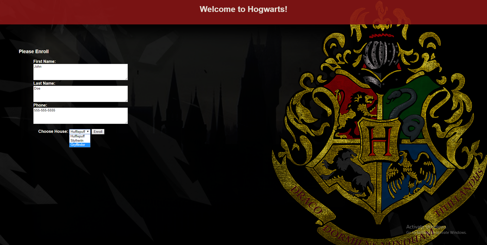

# School Enrollment

**Author**: Jeff Martinez  
**Version**: 1.0.0 

## Overview
This application provides a portal for student enrollment.  You can enter the students first and last name, phone number, and house of choice(Hogwarts).  You are then directed to a "view all" page where you can see the enrolled students.  These students are saved into a SQL server database.

## Getting Started
To build this application you need to use Visual Studio and select an MVC project
1. Build out your MVC folders and files
2. Add Dependency Injections
3. Add json connection string
4. Install MVC tools
5. Add-Migration
6. Create or Update-Database
7. Add IAction methods to Get and Post on website

## Example

## Architecture
This application is created using ASP.NET Core 2.0 Console applicaitons.  
*Language*: C#  
*Type of Applicaiton*: MVC Core Applicatoin  

## Change Log
01-11-2018 4:59pm - Added MVC functionality  
01-12-2018 6:0pm - Added CSS styling to pages  
